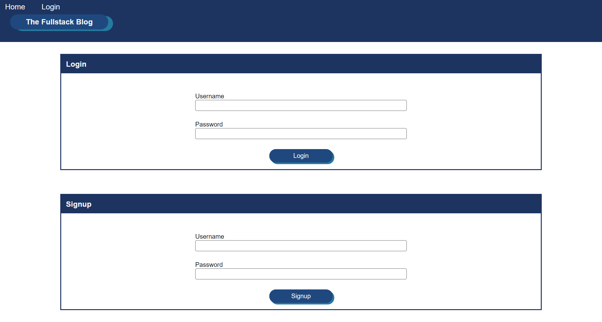

# The Fullstack Blog

## Description
Welcome to the Fullstack Blog. A blog for anything coding. This is a fullstack
web application that I have built from the ground up. It is a very basic user
friendly website

## Table of contents 
* [Description](#description)
* [Code Description](#CodeDescription)
* [Usage](#usage)
* [Links](#links)
* [Screenshots](#Screenshots)
* [Questions](#questions)

## Code Description
The coding languages, packages and wireframes used to create this web app.
this web application was build using the <strong>MVC</strong> paradigm. It uses
Express.js, Sequelize and mysql2 npm packages to handle the database, query
calls and model building. The front end is build using HTML, CSS, Javascript and
Handlebars.js to handle the html templates.  
* <strong>Languages and Packages</strong>
* HTML
* CSS
* Javascript
* mysql
* mysql2
* Express.js, Express sessions, Express handlebars.js
* Sequelize
* bcrypt
* dotenv

## Usage
This web application is straight forward and easy to use. If you want to just
look and at blog post you can do that. But if you want to create posts and leave
comments you will have to sign up! All you have to do to sign is click the login
button at the top of the page and fill out the nesscessary infomation click sign
up and you are good to go. To create posts just got your dashboard once logged
in and create a new post. If you want to leave a comment just click on a title
of a post can click the comment button.

## Links
* [The Fullstack Blog link](https://the-fullstack-blog.herokuapp.com/)
* [The Github repo link](https://github.com/mjbc53/fullstack-blog)

## Screenshots

## Questions
If you have any further questions please contact me by email or with my GitHub Username listed below

* Email : mjbc53@gmail.com

* GitHub [mjbc53](https://github.com/mjbc53) 

